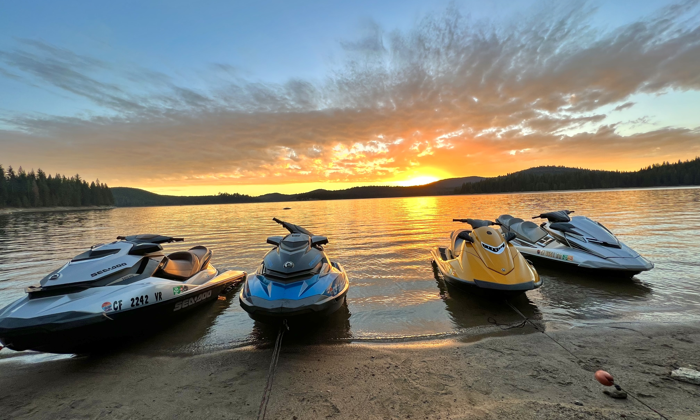
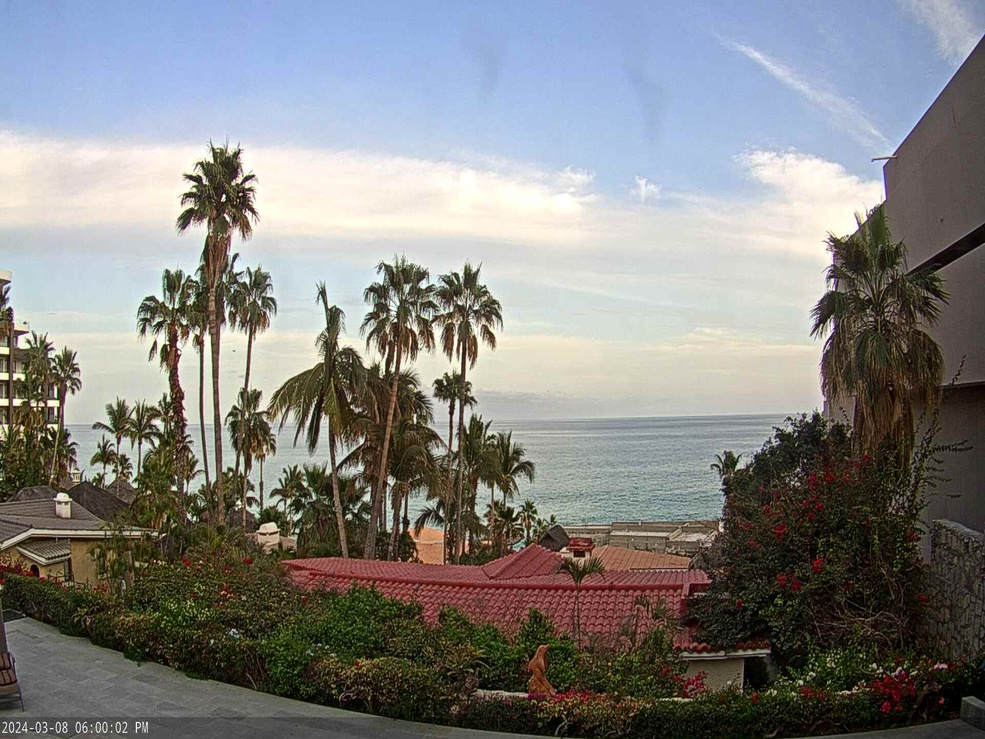

<head>
    <meta charset="UTF-8">
    <meta name="viewport" content="width=device-width, initial-scale=1.0">
    <link rel="stylesheet" href="styles.css">
</head>

<body>
    <header>
        <h1>Welcome to My Personal Website</h1>
        <nav>
            <ul>
        <!-- Hobbies Link -->
        <li> Hobbies</li>
        <!-- Travel Link -->
        <li> Travel</li>
        <!-- Friends Link -->
        <li> Friends</li>
    </ul>
        </nav>
    </header>
    <section>
        <h2>About Me</h2>
        

            I am a freshman at the University of Wisconsin-Madison, majoring in pre-business with plans to double major
            in finance and real estate.
             
            Born and raised in Wisconsin, my family of four includes my father Scott, mother Jan, and older brother
            Brett.
            We've lived in the same house our entire lives and enjoy participating in activities together.
             
            While we are big Wisconsin sports fans, supporting the Milwaukee Bucks and Green Bay Packers, I also
            cherish exploring new things and embracing the unknown factors that life presents.
             
            Despite our similarities, our unique differences contribute to shaping who I am today.
        

    </section>
    <section>
    <h2>Hobbies</h2>
        <!-- Content of the Hobbies section -->

        <!-- Navigation Link to Hobbies Page -->
        <ul>
            <li><a href="hobbies.html">Hobbies</a></li>
        </ul>
    </section>
    <section>
        <h2>Travel</h2>
        

            I have traveled to many places, but my favorite destinations throughout the years have been:
        

        <ol>
            <li>Paris, France</li>
            <li>Cabo San Lucas, Mexico</li>
            <li>London, England</li>
            <li>Belgium</li>
            <li>Whales</li>
            <li>Badlands, South Dakota</li>
            <li>Marco Island, Florida</li>
        </ol>
    </section>
    <section>
        <h2>Friends</h2>
        

            I have friends back home and have met new friends here in Madison, providing me with many old and new
            friends. My friends back home are very close because we have grown up together and experienced each
            other's worst and best days. We have 20 of us and have been in the same group together since freshman
            year of high school.
             
            After being in Madison for a few months so far, I have met new people and got to know new people. I am
            close with roughly 15 guys who share the same interests and partake in the same activities. My friends are
            very important to me because they are the ones that I rely on and can talk to about anything for hours.
        

        <h3>My Best Friends</h3>
        <ul>
            <li>
                <strong>Teddy:</strong> Friends for 8 years; we know everything about one another and can talk for
                hours.
            </li>
            <li>
                <strong>Philip:</strong> Friends for 6 years; we participate in the same hobbies and share the same
                interests.
            </li>
            <li>
                <strong>Maddie:</strong> Friends for many years; we do everything together, try new things, and always
                have each other's backs.
            </li>
        </ul>
    </section>
